# Setup Windows Environment (Driver) - ตั้งค่าสภาพแวดล้อม Windows (ไดร์เวอร์)

[Download CP210x_Universal_Windows_Driver](https://www.silabs.com/documents/public/software/CP210x_Universal_Windows_Driver.zip)

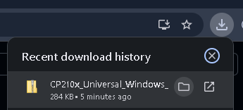

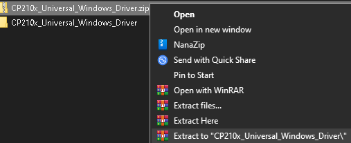

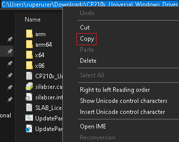

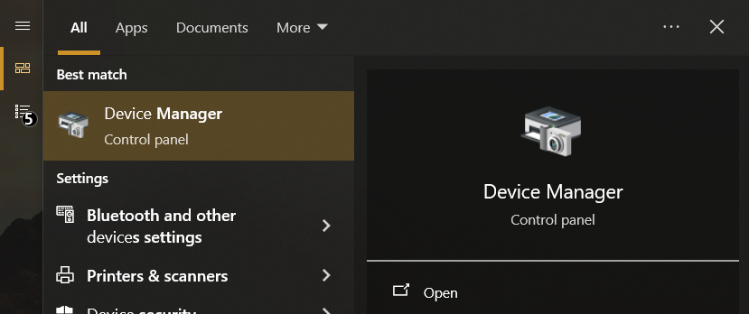

Windows Search > *Device Manager* > Open > Connect the PTBOT's USB Port

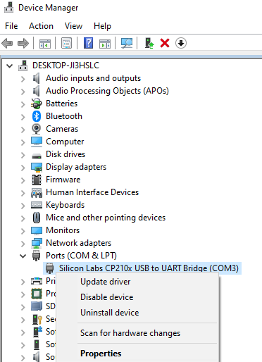

Ports (COM & LPT) > *Context Menu* > Update driver

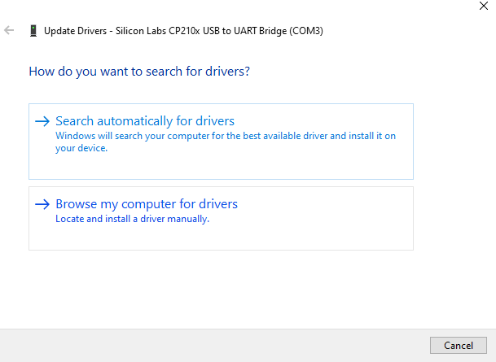

Browse my computer for drivers

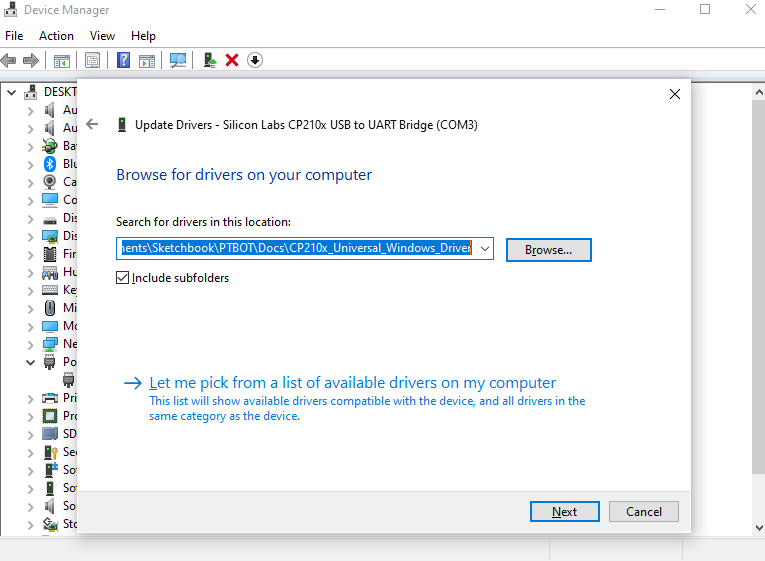

Search for driver in this location > *PTBOT\Docs\ [CP210x_Universal_Windows_Driver](https://www.silabs.com/documents/public/software/CP210x_Universal_Windows_Driver.zip)* > Include subfolders > Next > Close

---

# Setup Arduino IDE Environment - ตั้งค่าสภาพแวดล้อม Arduino IDE (Library)
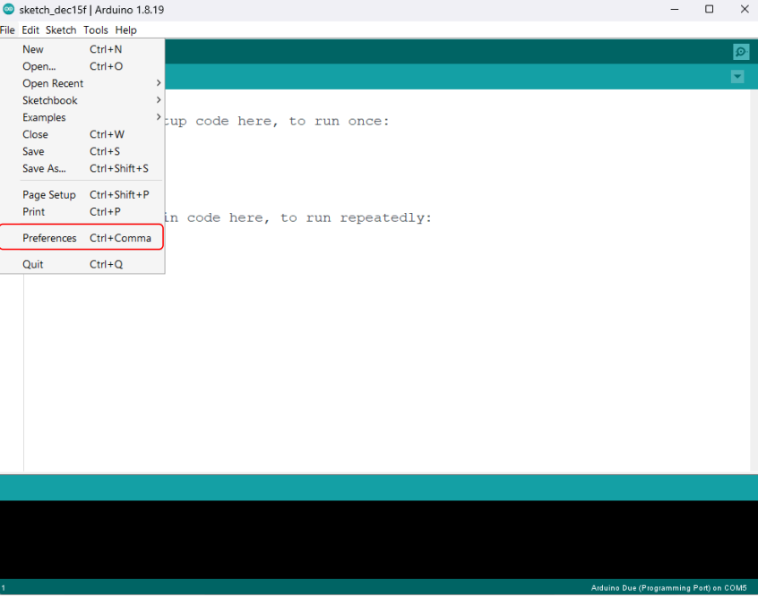

File > Preferences

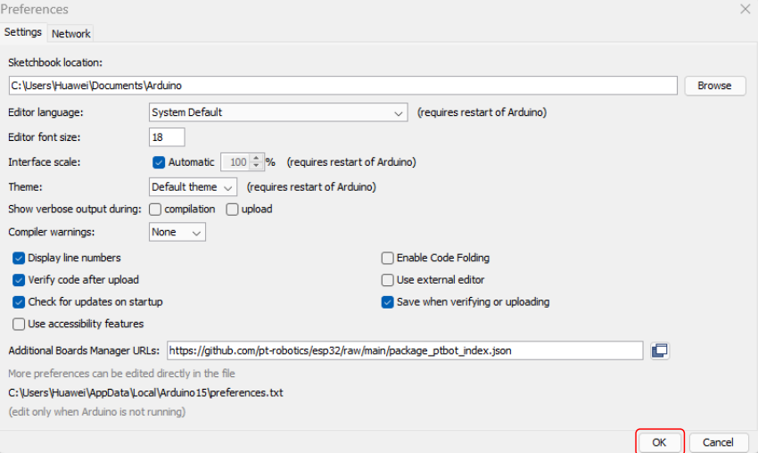

Additional Boards Manager URLs > *https://github.com/pt-robotics/esp32/raw/main/package_ptbot_index.json* > OK

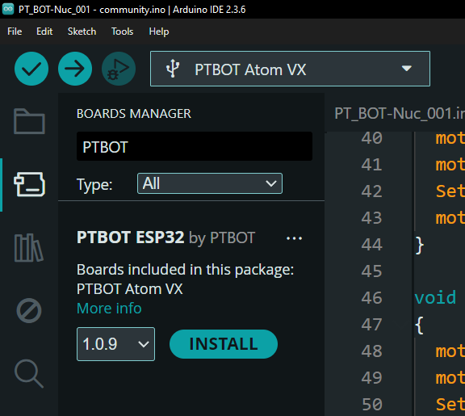

Boards Manager > *PTBOT* > INSTALL

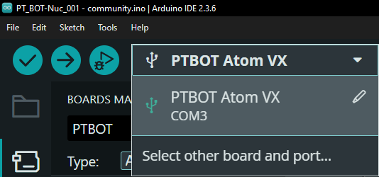

Select other board and port...

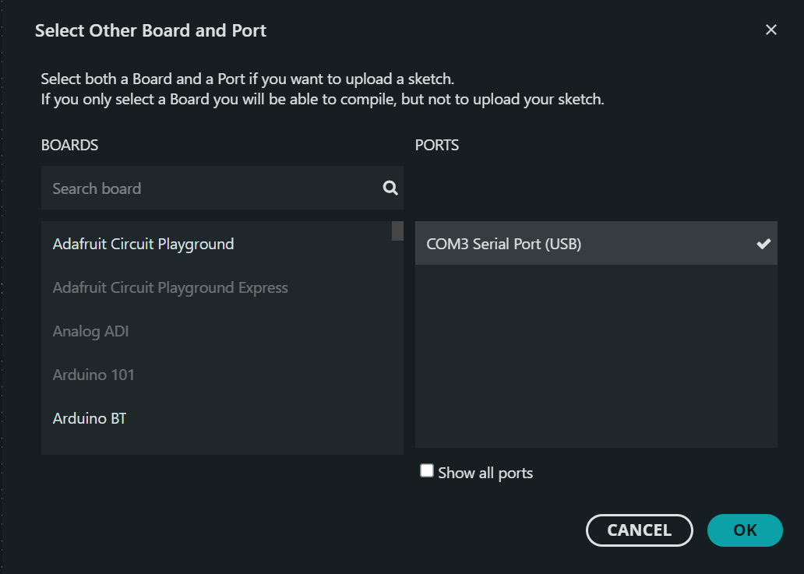

PORTS > OK
