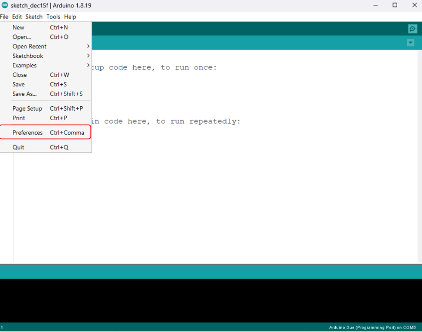
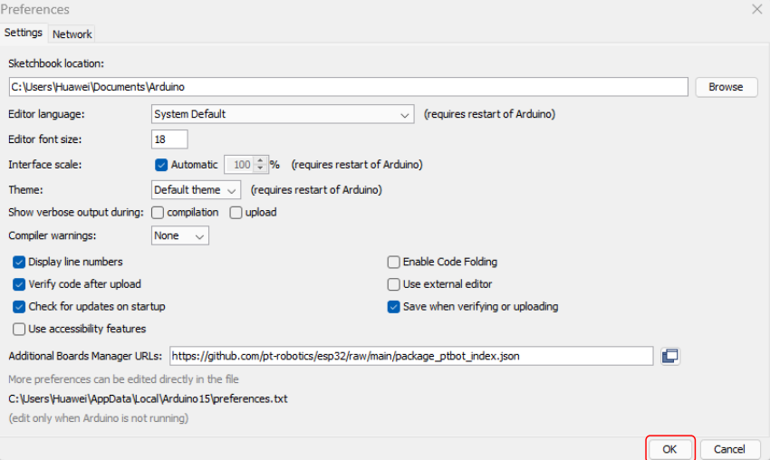
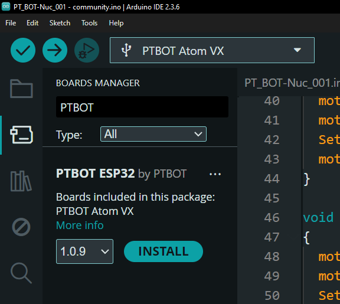
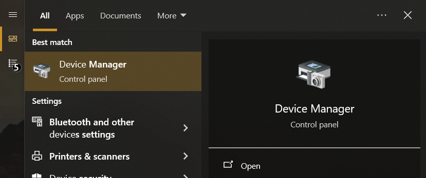
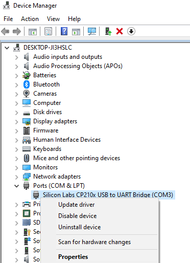
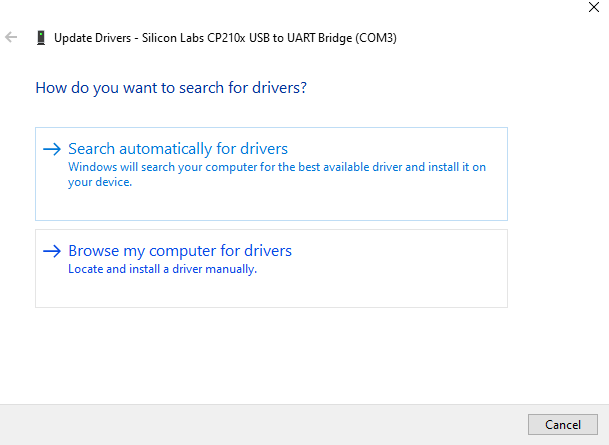
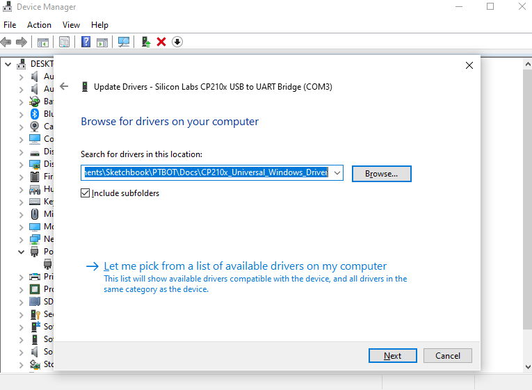
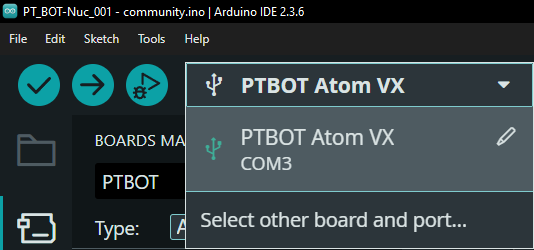
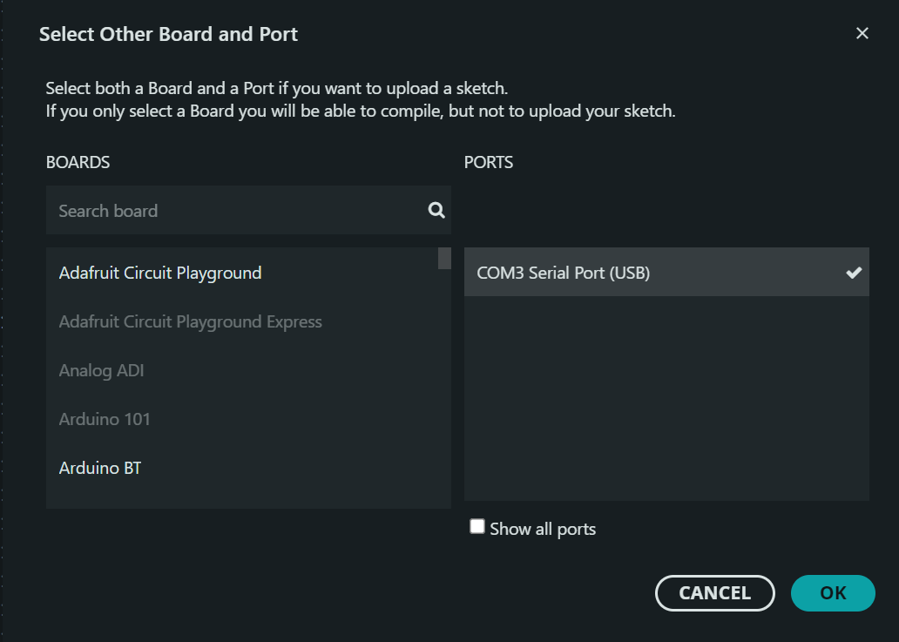

# Setup Arduino Environment

File > Preferences

Additional Boards Manager URLs > *https://github.com/pt-robotics/esp32/raw/main/package_ptbot_index.json* > OK

Boards Manager > *PTBOT* > INSTALL

# Setup Windows Environment

Windows Search > *Device Manager* > Open > Connect the PTBOT's USB Port

Ports (COM & LPT) > *Context Menu* > Update driver

Browse my computer for drivers

Search for driver in this location > *PTBOT\Docs\CP210x_Universal_Windows_Driver* > Include subfolders > Next > Close

# Setup Arduino Environment

Boards Manager > *PTBOT* > INSTALL

Select other board and port...

PORTS > OK
